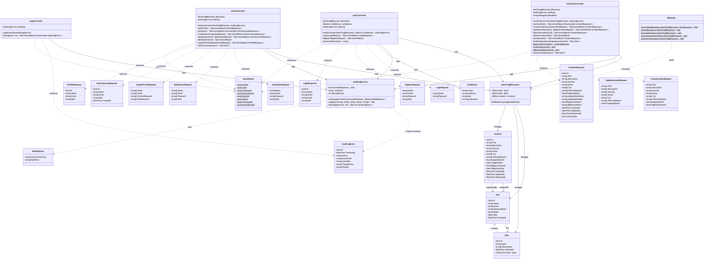

<div align="center">


# AlertFrog SIMS

[](#tech-stack)
[](#tech-stack)
[](#architecture)
[](#running-locally)
[](#features)

_Security Incident Management System (SIMS) built for SOC teams that need authentication, user administration, and a first-class incident workflow._

</div>

## Table of contents

1. [Features](#features)
2. [Architecture](#architecture)
3. [Tech stack](#tech-stack)
4. [Screens](#screens)
5. [Running locally](#running-locally)
6. [Environment variables](#environment-variables)
7. [Development scripts](#development-scripts)
8. [API surface](#api-surface)
9. [Roadmap](#roadmap)

## Features

- **Secure authentication** – JWT-based login backed by BCrypt hashing, with configurable expiry (default 8 hours).
- **Role-aware UI** – Admin, 1st Level, and 2nd Level responders receive tailored navigation and abilities.
- **User management** – Admin-only dashboard to list, create, update, and remove users with role assignment and password rotation.
- **Incident desk** – Full CRUD + resolve/escalate controls. Track severity, CVE, affected system, assignees, registrants, and timestamps.
- **Dashboard insights** – Aggregated active/resolved metrics synced live with backend data.
- **Dark-theme UX** – Vite + React SPA styled in AlertFrog’s neon-green brand language.
- **Dockerized stack** – Backend, frontend, MySQL, and Redis orchestrated via docker-compose for one-command startup.
- **Seeded data** – Automatic admin + responder seeding and example incidents ensure the UI is populated on first launch.

## Architecture

```
├── backend/            # ASP.NET Core 8 WebAPI
│   ├── Controllers     # Auth, Users, Incidents, Logs
│   ├── Data            # DbContext + DbSeeder + EF migrations
│   ├── Models          # User, Role, Incident domain entities
│   ├── Services        # AuditLogService (Redis-backed logging)
│   ├── Requests        # API request DTOs
│   ├── Responses       # API response DTOs
│   ├── Options         # JWT + Redis configuration binding
│   └── Constants       # SystemRoles with GUIDs
├── frontend/           # React 18 + TypeScript + Vite SPA
│   ├── src/pages       # Login, Dashboard, Incidents, Settings, User Mgmt, Logs
│   ├── src/hooks       # useIncidents, session helpers
│   └── src/types       # Shared DTO definitions
├── infra/              # docker-compose.yml, env templates
├── docs/               # Project plan, architecture notes, UML diagram
└── assets/             # Logos/screenshots
```

The backend exposes REST endpoints secured with JWT bearer auth. EF Core (Pomelo MySQL provider) maps `Users`, `Roles`, and `Incidents`. Seeder ensures roles (Admin, 1st Level, 2nd Level, User) plus a default `admin@alertfrog.com` account and SOC responders exist. Redis stores audit logs for all user/incident operations.

The frontend consumes these APIs via `fetch` and central hooks. Session state lives in `localStorage` under `alertfrog_session` and drives conditional navigation.

### UML Class Diagram

For a comprehensive view of all classes, relationships, and dependencies, see the [UML Diagram](docs/UML-Diagram.md).



## Tech stack

| Layer     | Technology |
|-----------|------------|
| Frontend  | React 18, TypeScript, Vite, CSS Modules |
| Backend   | ASP.NET Core 8, EF Core, JWT Auth |
| Database  | MySQL 8 (Pomelo provider) |
| Messaging | Redis 7 (available for logging / caching hooks) |
| Tooling   | docker-compose, dotnet-ef local tools |

## Screens

| Dashboard | Incident Desk |
|-----------|---------------|
|  |  |

> _Screens live under `assets/`; update them as the UI evolves._

## Running locally

```bash
# 0. Pre-reqs: Docker Desktop, Node 20+, .NET 8 SDK (for local tooling)

# 1. Copy env template and customize ports/secrets if needed
cp infra/.env.example infra/.env

# 2. Launch the stack
docker compose -f infra/docker-compose.yml --env-file infra/.env up -d --build

# 3. Access services
#   Frontend SPA     -> http://localhost:5173
#   Backend + Swagger-> http://localhost:8080
#   MySQL            -> localhost:3306 (see infra/.env)
#   Redis            -> localhost:6379

# Tail logs
docker compose -f infra/docker-compose.yml logs -f backend
```

### Applying EF Core migrations

```bash
# From repo root (installs local dotnet-ef tool via manifest)
dotnet tool restore
dotnet tool run dotnet-ef migrations add SomeChange --project backend/Backend.csproj --startup-project backend/Backend.csproj
dotnet tool run dotnet-ef database update --project backend/Backend.csproj --startup-project backend/Backend.csproj
```

> When the DB schema is already provisioned by Docker, connect to the running MySQL container and run the ALTER script (credentials in `infra/.env`).

## Environment variables

`infra/.env.example` documents every variable consumed by docker-compose:

| Variable | Description |
|----------|-------------|
| `MYSQL_*` | DB name, user, and passwords used by MySQL + backend |
| `REDIS_HOST/PORT` | Redis connection injected into backend |
| `JWT_*` | Issuer, audience, signing key, and expiry minutes for token generation |
| `VITE_API_BASE_URL` | Base URL used by the frontend to reach the API |

## Development scripts

- `docker compose ... up -d --build` – start or rebuild the entire stack
- `docker compose ... logs -f backend` – follow backend logs (includes EF SQL output)
- `npm install && npm run dev` (inside `frontend/`) – optional local-only Vite dev server
- `dotnet watch run` (inside `backend/`) – hot reload backend without Docker

## API surface

| Method | Endpoint | Description | Auth |
|--------|----------|-------------|------|
| `POST` | `/api/auth/login` | Returns JWT + session payload | Public |
| `GET`  | `/api/users/me` | Current profile | Bearer |
| `PUT`  | `/api/users/me` | Update name/email/password | Bearer |
| `GET`  | `/api/users` | Admin list of users | Admin |
| `POST` | `/api/users` | Create user | Admin |
| `PUT`  | `/api/users/{id}` | Update user | Admin |
| `DELETE` | `/api/users/{id}` | Delete user | Admin |
| `GET`  | `/api/incidents` | List incidents | Bearer |
| `POST` | `/api/incidents` | Create incident | Admin / Tier 1 / Tier 2 |
| `PUT`  | `/api/incidents/{id}` | Update incident | Admin / Tier 1 / Tier 2 |
| `POST` | `/api/incidents/{id}/resolve` | Resolve incident | Admin / Tier 1 / Tier 2 |
| `POST` | `/api/incidents/{id}/escalate` | Escalate to higher tier | Bearer |
| `DELETE` | `/api/incidents/{id}` | Delete incident | Admin |

Swagger UI at `http://localhost:8080` lists full request/response contracts.

## Roadmap

- ✅ Role-based authentication, seeding, and admin workflows
- ✅ Incident CRUD with escalation + resolution pipeline
- ✅ Dedicated settings page and admin-only user dashboard
- ⬜ Integrate Redis-backed audit logging
- ⬜ Add automated tests + CI pipeline
- ⬜ Implement notification channel (email / Slack) when incidents escalate
- ⬜ Harden infra (TLS termination, production-ready compose profiles)

---

_Questions or ideas? Drop them in issues or open a discussion in `docs/`._
