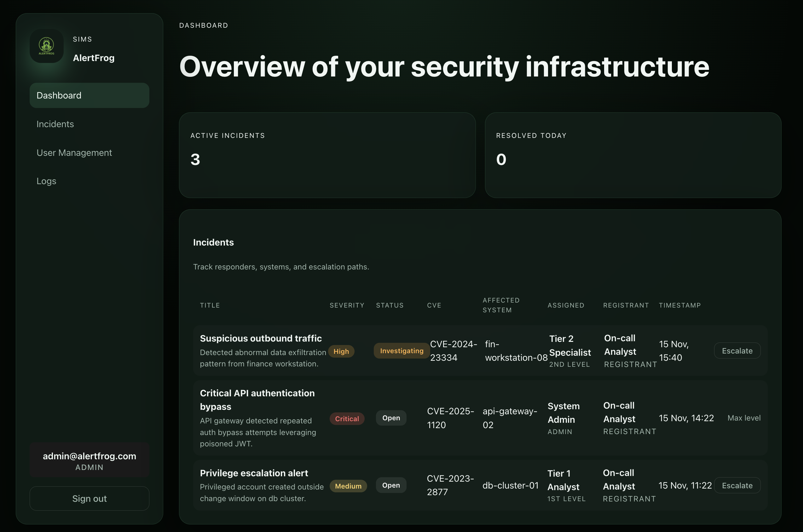
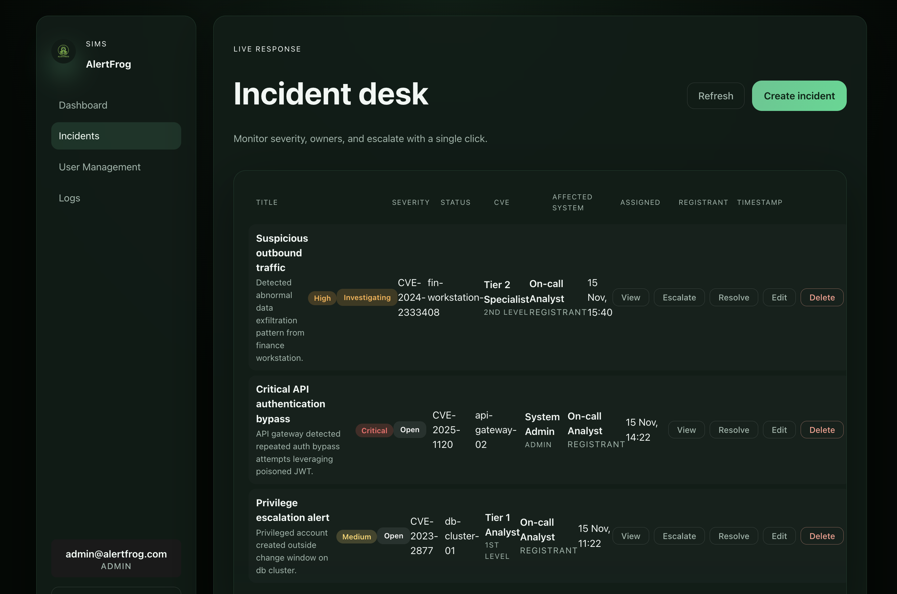

<div align="center">


# AlertFrog SIMS

[](#tech-stack)
[](#tech-stack)
[](#tech-stack)
[](#tech-stack)
[](#architecture)
[](#architecture)
[](#getting-started)
[](#security)
[](#architecture)
[](#features)

_Security Incident Management System (SIMS) built for SOC teams that need authentication, user administration, and a first-class incident workflow._

</div>

## Table of contents

1. [Features](#features)
2. [Tech Stack](#tech-stack)
3. [Getting Started](#getting-started)
   - [Running Locally](#running-locally)
   - [Environment Variables](#environment-variables)
   - [Default Credentials](#default-credentials)
4. [Screens](#screens)
5. [Architecture](#architecture)
   - [Project Structure](#project-structure)
   - [Database Structure](#database-structure)
   - [Architecture Diagrams](#architecture-diagrams)
6. [API Reference](#api-reference)
7. [Development](#development)
8. [Security](#security)
9. [Documentation](#documentation)

## Features

- **Secure authentication** – JWT-based login backed by BCrypt hashing, with configurable expiry (default 8 hours).
- **Role-based access control** – Four distinct roles (Admin, User, 1st Level, 2nd Level) with tailored permissions and UI navigation.
- **User management** – Admin-only dashboard to list, create, update, and remove users with role assignment and password rotation.
- **Incident management** – Full CRUD + resolve/escalate controls. Track severity, CVE, affected system, assignees, registrants, and timestamps.
- **Incident escalation** – Automated escalation chain: 1st Level → 2nd Level → Admin with role-based permissions.
- **Audit logging** – Comprehensive Redis-backed audit trail for all user logins, user modifications, and incident operations.
- **Admin logs dashboard** – Real-time audit log viewer with pagination, showing timestamp, action, actor, target, and details.
- **Dashboard insights** – Aggregated active/resolved incident metrics synced live with backend data.
- **Dark-theme UX** – Vite + React SPA styled in AlertFrog's neon-green brand language with responsive design.
- **Dockerized stack** – Backend, frontend, MySQL, and Redis orchestrated via docker-compose for one-command startup.
- **Seeded data** – Automatic role, admin, and responder seeding with example incidents ensure the UI is populated on first launch.

## Tech stack

| Layer     | Technology |
|-----------|------------|
| Frontend  | React 18, TypeScript, Vite, CSS Modules |
| Backend   | ASP.NET Core 8, EF Core, JWT Auth |
| Database  | MySQL 8 (Pomelo provider) |
| Cache/Logs | Redis 7 (audit logging, capped at 1000 entries) |
| Tooling   | docker-compose, dotnet-ef local tools |

## Getting Started

### Running locally

```bash
# 0. Pre-reqs: Docker Desktop, Node 20+, .NET 8 SDK (for local tooling)

# 1. Copy env template and customize ports/secrets if needed
cp infra/.env.example infra/.env

# 2. Launch the stack
docker compose -f infra/docker-compose.yml --env-file infra/.env up -d --build

# 3. Access services
#   Frontend SPA     -> http://localhost:5173
#   Backend + Swagger-> http://localhost:8080
#   MySQL            -> localhost:3306 (see infra/.env)
#   Redis            -> localhost:6379

# Tail logs
docker compose -f infra/docker-compose.yml logs -f backend
```

### Environment variables

`infra/.env.example` documents every variable consumed by docker-compose:

| Variable | Description |
|----------|-------------|
| `MYSQL_*` | DB name, user, and passwords used by MySQL + backend |
| `REDIS_HOST/PORT` | Redis connection injected into backend |
| `JWT_*` | Issuer, audience, signing key, and expiry minutes for token generation |
| `VITE_API_BASE_URL` | Base URL used by the frontend to reach the API |

### Default Credentials

**Admin Account:**
- Email: `admin@alertfrog.com`
- Password: `alertfrog`

⚠️ **Change these credentials immediately in production!**

## Screens

| Dashboard | Incident Desk |
|-----------|---------------|
|  |  |

> _Screens live under `assets/`; update them as the UI evolves._

## Architecture

### Project Structure

```
├── backend/            # ASP.NET Core 8 WebAPI
│   ├── Controllers     # Auth, Users, Incidents, Logs
│   ├── Data            # DbContext + DbSeeder + EF migrations
│   ├── Models          # User, Role, Incident domain entities
│   ├── Services        # AuditLogService (Redis-backed logging)
│   ├── Requests        # API request DTOs
│   ├── Responses       # API response DTOs
│   ├── Options         # JWT + Redis configuration binding
│   └── Constants       # SystemRoles with GUIDs
├── frontend/           # React 18 + TypeScript + Vite SPA
│   ├── src/pages       # Login, Dashboard, Incidents, Settings, User Mgmt, Logs
│   ├── src/hooks       # useIncidents, session helpers
│   └── src/types       # Shared DTO definitions
├── infra/              # docker-compose.yml, env templates
├── docs/               # Project plan, architecture notes, UML diagram
└── assets/             # Logos/screenshots
```

The backend exposes REST endpoints secured with JWT bearer authentication. Entity Framework Core with Pomelo MySQL provider manages `Users`, `Roles`, and `Incidents` entities. Database seeding ensures four roles (Admin, User, 1st Level, 2nd Level), a default admin account (`admin@alertfrog.com`), SOC responders, and sample incidents are created on first launch. Redis stores a capped audit log (1000 entries) for all authentication events, user modifications, and incident operations.

The frontend is a React 18 + TypeScript SPA built with Vite, consuming backend APIs via native `fetch`. Session state persists in `localStorage` under the `alertfrog_session` key and drives role-based navigation and UI rendering. The application features a dark theme with neon-green accents matching the AlertFrog brand.

### Database Structure

#### MySQL Schema

The MySQL database contains three core tables managed by Entity Framework Core:

**Roles**

| Column | Type | Constraints | Description |
|--------|------|-------------|-------------|
| `Id` | GUID | PK | Unique role identifier |
| `Name` | VARCHAR | NOT NULL | Role name (Admin, User, 1st Level, 2nd Level) |
| `CreatedAt` | DATETIME | NOT NULL | Creation timestamp |

**Users**

| Column | Type | Constraints | Description |
|--------|------|-------------|-------------|
| `Id` | GUID | PK | Unique user identifier |
| `Email` | VARCHAR | UNIQUE, NOT NULL | User email address |
| `Name` | VARCHAR | NOT NULL | Display name |
| `PasswordHash` | VARCHAR | NOT NULL | BCrypt hashed password |
| `RoleId` | GUID | FK → Roles.Id | Assigned role |
| `CreatedAt` | DATETIME | NOT NULL | Account creation timestamp |

**Incidents**

| Column | Type | Constraints | Description |
|--------|------|-------------|-------------|
| `Id` | GUID | PK | Unique incident identifier |
| `Title` | VARCHAR | NOT NULL | Incident title |
| `Description` | TEXT | NOT NULL | Detailed description |
| `Severity` | VARCHAR | NOT NULL | Low, Medium, High, Critical |
| `Status` | VARCHAR | NOT NULL | Open, Investigating, Resolved |
| `Cve` | VARCHAR | NULL | CVE identifier (e.g., CVE-2025-1234) |
| `AffectedSystem` | VARCHAR | NULL | System name/hostname |
| `AssignedUserId` | GUID | FK → Users.Id | Current assignee |
| `RegistrantUserId` | GUID | FK → Users.Id | User who created the incident |
| `CreatedAt` | DATETIME | NOT NULL | Incident creation timestamp |
| `UpdatedAt` | DATETIME | NOT NULL | Last modification timestamp |
| `ResolvedAt` | DATETIME | NULL | Resolution timestamp |

#### Redis Structure

Redis is used exclusively for audit logging with a capped list structure:

| Property | Value | Description |
|----------|-------|-------------|
| **Key** | `alertfrog:audit_log` | Redis key for audit log list |
| **Type** | List | Redis data structure (LPUSH/LTRIM) |
| **Max Entries** | 1000 | Automatically trimmed to maintain cap |
| **Pattern** | FIFO | Oldest entries removed when limit reached |

**Audit Log Entry Format (JSON):**

| Field | Type | Example | Description |
|-------|------|---------|-------------|
| `timestamp` | ISO 8601 | `2025-11-22T10:15:00Z` | When the action occurred |
| `action` | String | `User Login`, `Incident Created` | Type of action performed |
| `actorEmail` | String | `admin@alertfrog.com` | Email of user who performed action |
| `actorRole` | String | `Admin`, `1st Level` | Role of the actor |
| `targetEntity` | String | `Incident: Server Breach` | Entity affected by the action |
| `details` | String | `Severity: High, Status: Open` | Additional context about the action |

All authentication events, user CRUD operations, and incident modifications are logged to this capped list, providing a rolling audit trail accessible via the admin logs dashboard.

### Architecture Diagrams

#### Layered Architecture

```mermaid
%%{init: {'theme':'base', 'themeVariables': { 'primaryColor':'#1a1a1a','primaryTextColor':'#fff','primaryBorderColor':'#00ff88','lineColor':'#00ff88','secondaryColor':'#2a2a2a','tertiaryColor':'#3a3a3a','fontSize':'18px','fontFamily':'Arial'}}}%%
graph TB
    subgraph API["🌐 API Layer (Controllers)"]
        AUTH[AuthController<br/>Login/Register]
        USERS[UsersController<br/>User CRUD]
        INCIDENTS[IncidentsController<br/>Incident CRUD]
        LOGS[LogsController<br/>Audit Logs]
    end
    
    subgraph SERVICE["⚙️ Service Layer"]
        AUDIT[AuditLogService<br/>Redis Logging]
    end
    
    subgraph DATA["💾 Data Layer"]
        DBCONTEXT[AlertFrogDbContext<br/>EF Core]
        SEEDER[DbSeeder<br/>Initial Data]
    end
    
    subgraph DOMAIN["📦 Domain Models"]
        USER[User]
        ROLE[Role]
        INCIDENT[Incident]
    end
    
    subgraph STORAGE["🗄️ Storage"]
        MYSQL[(MySQL<br/>Relational Data)]
        REDIS[(Redis<br/>Audit Logs)]
    end
    
    subgraph CONFIG["⚙️ Configuration"]
        JWT[JwtOptions]
        REDISOPT[RedisOptions]
        SYSROLES[SystemRoles]
    end
    
    %% API to Service
    AUTH -.->|logs| AUDIT
    USERS -.->|logs| AUDIT
    INCIDENTS -.->|logs| AUDIT
    LOGS -->|reads| AUDIT
    
    %% API to Data
    AUTH -->|queries| DBCONTEXT
    USERS -->|CRUD| DBCONTEXT
    INCIDENTS -->|CRUD| DBCONTEXT
    
    %% API to Config
    AUTH -.->|uses| JWT
    AUTH -.->|enforces| SYSROLES
    USERS -.->|enforces| SYSROLES
    INCIDENTS -.->|enforces| SYSROLES
    LOGS -.->|enforces| SYSROLES
    
    %% Service to Storage
    AUDIT -->|writes/reads| REDIS
    AUDIT -.->|config| REDISOPT
    
    %% Data to Domain
    DBCONTEXT -->|manages| USER
    DBCONTEXT -->|manages| ROLE
    DBCONTEXT -->|manages| INCIDENT
    SEEDER -.->|seeds| DBCONTEXT
    
    %% Data to Storage
    DBCONTEXT -->|persists| MYSQL
    
    %% Domain Relationships
    USER -->|has| ROLE
    INCIDENT -->|assignedTo| USER
    INCIDENT -->|registeredBy| USER
    
    style API fill:#2a4a2a,stroke:#00ff88,stroke-width:3px
    style SERVICE fill:#2a3a4a,stroke:#00ff88,stroke-width:3px
    style DATA fill:#4a2a3a,stroke:#00ff88,stroke-width:3px
    style DOMAIN fill:#3a2a4a,stroke:#00ff88,stroke-width:3px
    style STORAGE fill:#4a3a2a,stroke:#00ff88,stroke-width:3px
    style CONFIG fill:#2a2a3a,stroke:#00ff88,stroke-width:3px
```



#### Incident Creation Flow

```mermaid
%%{init: {'theme':'base', 'themeVariables': { 'primaryColor':'#1a1a1a','primaryTextColor':'#fff','primaryBorderColor':'#00ff88','lineColor':'#00ff88','fontSize':'18px'}}}%%
flowchart LR
    A[Client] -->|POST /api/incidents| B[IncidentsController]
    B -->|Validate JWT| C{Authorized?}
    C -->|No| D[401 Unauthorized]
    C -->|Yes| E[CreateIncident]
    E -->|Query Users| F[DbContext]
    F -->|SELECT| G[(MySQL)]
    G -->|Users| F
    F -->|Entities| E
    E -->|Create Incident| F
    F -->|INSERT| G
    G -->|Success| F
    F -->|Entity| E
    E -->|Log Action| H[AuditLogService]
    H -->|LPUSH| I[(Redis)]
    I -->|OK| H
    H -->|Logged| E
    E -->|Map to DTO| J[IncidentResponse]
    J -->|201 Created| A
    
    style B fill:#2a4a2a,stroke:#00ff88,stroke-width:2px
    style F fill:#4a2a3a,stroke:#00ff88,stroke-width:2px
    style H fill:#2a3a4a,stroke:#00ff88,stroke-width:2px
    style G fill:#4a3a2a,stroke:#00ff88,stroke-width:2px
    style I fill:#4a3a2a,stroke:#00ff88,stroke-width:2px
```



For detailed architecture documentation and additional diagrams, see:
- [Simplified Architecture Diagrams](docs/UML-Diagram-Simplified.md) - Recommended overview
- [Full UML Class Diagram](docs/UML-Diagram.md) - Complete technical reference

## API Reference

| Method | Endpoint | Description | Auth |
|--------|----------|-------------|------|
| **Authentication** | | | |
| `POST` | `/api/auth/login` | Returns JWT + session payload | Public |
| `POST` | `/api/auth/register` | Register new user | Public |
| **User Profile** | | | |
| `GET`  | `/api/users/me` | Get current user profile | Bearer |
| `PUT`  | `/api/users/me` | Update own name/email/password | Bearer |
| **User Management** | | | |
| `GET`  | `/api/users` | List all users | Admin |
| `POST` | `/api/users` | Create new user | Admin |
| `PUT`  | `/api/users/{id}` | Update user details | Admin |
| `DELETE` | `/api/users/{id}` | Delete user | Admin |
| **Incident Management** | | | |
| `GET`  | `/api/incidents` | List all incidents | Bearer |
| `GET`  | `/api/incidents/{id}` | Get single incident by ID | Bearer |
| `POST` | `/api/incidents` | Create new incident | Admin / 1st Level / 2nd Level |
| `PUT`  | `/api/incidents/{id}` | Update incident | Admin / 1st Level / 2nd Level |
| `POST` | `/api/incidents/{id}/resolve` | Mark incident as resolved | Admin / 1st Level / 2nd Level |
| `POST` | `/api/incidents/{id}/escalate` | Escalate to higher tier | Bearer |
| `DELETE` | `/api/incidents/{id}` | Delete incident | Admin |
| **Audit Logs** | | | |
| `GET`  | `/api/logs?count=100&skip=0` | Retrieve audit logs (paginated) | Admin |

Swagger UI at `http://localhost:8080` lists full request/response contracts.

## Development

### Development Scripts

- `docker compose ... up -d --build` – start or rebuild the entire stack
- `docker compose ... logs -f backend` – follow backend logs (includes EF SQL output)
- `npm install && npm run dev` (inside `frontend/`) – optional local-only Vite dev server
- `dotnet watch run` (inside `backend/`) – hot reload backend without Docker

### Applying EF Core Migrations

```bash
# From repo root (installs local dotnet-ef tool via manifest)
dotnet tool restore
dotnet tool run dotnet-ef migrations add SomeChange --project backend/Backend.csproj --startup-project backend/Backend.csproj
dotnet tool run dotnet-ef database update --project backend/Backend.csproj --startup-project backend/Backend.csproj
```

> When the DB schema is already provisioned by Docker, connect to the running MySQL container and run the ALTER script (credentials in `infra/.env`).

## Security

AlertFrog SIMS implements multiple layers of security:

- **Authentication**: JWT tokens with BCrypt password hashing
- **Authorization**: Role-based access control (RBAC) with four distinct roles
- **Input Validation**: Request DTOs with validation attributes
- **SQL Injection Protection**: EF Core parameterized queries
- **Audit Trail**: Comprehensive logging of all security-relevant operations
- **CORS**: Configured for development and production environments

### Security Audit

A comprehensive SAST (Static Application Security Testing) scan has been performed. See [Security Audit Report](docs/SECURITY-AUDIT.md) for:
- Detailed security findings and remediation steps
- OWASP Top 10 2021 compliance mapping
- Container security hardening recommendations
- Best practices for production deployment

## Documentation

- **[Security Audit Report](docs/SECURITY-AUDIT.md)** - SAST scan results and security recommendations
- **[Simplified Architecture Diagrams](docs/UML-Diagram-Simplified.md)** - Layered architecture and flow diagrams
- **[Full UML Class Diagram](docs/UML-Diagram.md)** - Complete technical class diagram
- **[Project Plan](docs/ProjectPlan.md)** - Original project planning and requirements
- **[Project Structure](docs/ProjectStructure.md)** - Detailed file structure and organization

---

## Disclaimer

This project was developed with the assistance of AI tools to accelerate development and enhance code quality. AI was used for:
- Code generation and refactoring
- Documentation writing and structuring
- Architecture design suggestions
- Security best practices implementation

All AI-generated code has been reviewed, tested, and validated to ensure it meets security and quality standards.

---

_Questions or ideas? Drop them in issues or open a discussion in `docs/`._
