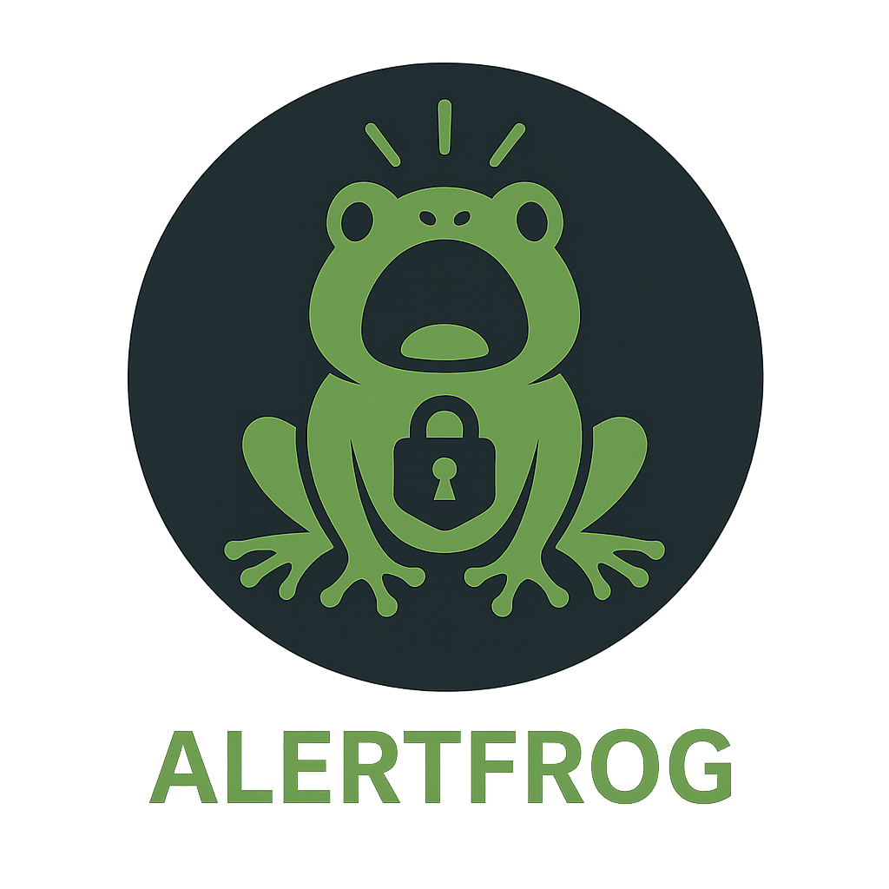
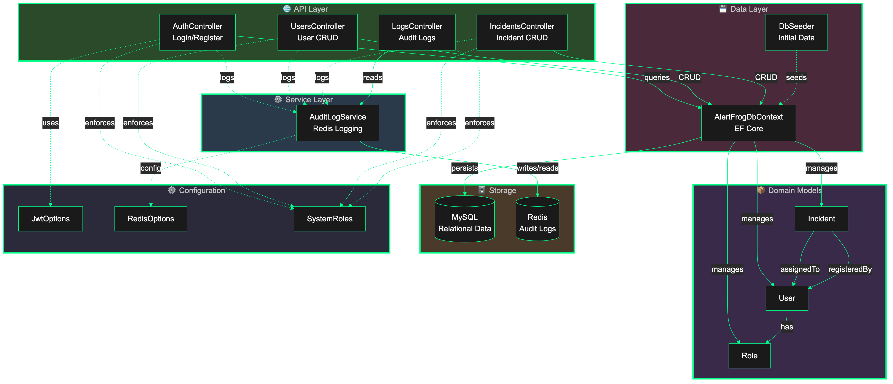
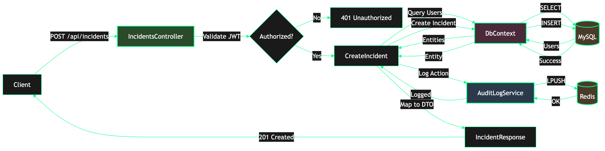

<div align="center">



# AlertFrog SIMS

[](#tech-stack)
[](#tech-stack)
[](#architecture)
[](#running-locally)
[](#features)

_Security Incident Management System (SIMS) built for SOC teams that need authentication, user administration, and a first-class incident workflow._

</div>

## Table of contents

1. [Features](#features)
2. [Architecture](#architecture)
3. [Tech stack](#tech-stack)
4. [Screens](#screens)
5. [Running locally](#running-locally)
6. [Environment variables](#environment-variables)
7. [Development scripts](#development-scripts)
8. [API surface](#api-surface)
9. [Security](#security)
10. [Documentation](#documentation)

## Features

- **Secure authentication** – JWT-based login backed by BCrypt hashing, with configurable expiry (default 8 hours).
- **Role-based access control** – Four distinct roles (Admin, User, 1st Level, 2nd Level) with tailored permissions and UI navigation.
- **User management** – Admin-only dashboard to list, create, update, and remove users with role assignment and password rotation.
- **Incident management** – Full CRUD + resolve/escalate controls. Track severity, CVE, affected system, assignees, registrants, and timestamps.
- **Incident escalation** – Automated escalation chain: 1st Level → 2nd Level → Admin with role-based permissions.
- **Audit logging** – Comprehensive Redis-backed audit trail for all user logins, user modifications, and incident operations.
- **Admin logs dashboard** – Real-time audit log viewer with pagination, showing timestamp, action, actor, target, and details.
- **Dashboard insights** – Aggregated active/resolved incident metrics synced live with backend data.
- **Dark-theme UX** – Vite + React SPA styled in AlertFrog's neon-green brand language with responsive design.
- **Dockerized stack** – Backend, frontend, MySQL, and Redis orchestrated via docker-compose for one-command startup.
- **Seeded data** – Automatic role, admin, and responder seeding with example incidents ensure the UI is populated on first launch.

## Architecture

```
├── backend/            # ASP.NET Core 8 WebAPI
│   ├── Controllers     # Auth, Users, Incidents, Logs
│   ├── Data            # DbContext + DbSeeder + EF migrations
│   ├── Models          # User, Role, Incident domain entities
│   ├── Services        # AuditLogService (Redis-backed logging)
│   ├── Requests        # API request DTOs
│   ├── Responses       # API response DTOs
│   ├── Options         # JWT + Redis configuration binding
│   └── Constants       # SystemRoles with GUIDs
├── frontend/           # React 18 + TypeScript + Vite SPA
│   ├── src/pages       # Login, Dashboard, Incidents, Settings, User Mgmt, Logs
│   ├── src/hooks       # useIncidents, session helpers
│   └── src/types       # Shared DTO definitions
├── infra/              # docker-compose.yml, env templates
├── docs/               # Project plan, architecture notes, UML diagram
└── assets/             # Logos/screenshots
```

The backend exposes REST endpoints secured with JWT bearer authentication. Entity Framework Core with Pomelo MySQL provider manages `Users`, `Roles`, and `Incidents` entities. Database seeding ensures four roles (Admin, User, 1st Level, 2nd Level), a default admin account (`admin@alertfrog.com`), SOC responders, and sample incidents are created on first launch. Redis stores a capped audit log (1000 entries) for all authentication events, user modifications, and incident operations.

The frontend is a React 18 + TypeScript SPA built with Vite, consuming backend APIs via native `fetch`. Session state persists in `localStorage` under the `alertfrog_session` key and drives role-based navigation and UI rendering. The application features a dark theme with neon-green accents matching the AlertFrog brand.

### Architecture Diagrams

#### Layered Architecture



#### Incident Creation Flow



For detailed architecture documentation and additional diagrams, see:
- [Simplified Architecture Diagrams](docs/UML-Diagram-Simplified.md) - Recommended overview
- [Full UML Class Diagram](docs/UML-Diagram.md) - Complete technical reference

## Tech stack

| Layer     | Technology |
|-----------|------------|
| Frontend  | React 18, TypeScript, Vite, CSS Modules |
| Backend   | ASP.NET Core 8, EF Core, JWT Auth |
| Database  | MySQL 8 (Pomelo provider) |
| Cache/Logs | Redis 7 (audit logging, capped at 1000 entries) |
| Tooling   | docker-compose, dotnet-ef local tools |

## Screens

| Dashboard | Incident Desk |
|-----------|---------------|
|  |  |

> _Screens live under `assets/`; update them as the UI evolves._

## Running locally

```bash
# 0. Pre-reqs: Docker Desktop, Node 20+, .NET 8 SDK (for local tooling)

# 1. Copy env template and customize ports/secrets if needed
cp infra/.env.example infra/.env

# 2. Launch the stack
docker compose -f infra/docker-compose.yml --env-file infra/.env up -d --build

# 3. Access services
#   Frontend SPA     -> http://localhost:5173
#   Backend + Swagger-> http://localhost:8080
#   MySQL            -> localhost:3306 (see infra/.env)
#   Redis            -> localhost:6379

# Tail logs
docker compose -f infra/docker-compose.yml logs -f backend
```

### Applying EF Core migrations

```bash
# From repo root (installs local dotnet-ef tool via manifest)
dotnet tool restore
dotnet tool run dotnet-ef migrations add SomeChange --project backend/Backend.csproj --startup-project backend/Backend.csproj
dotnet tool run dotnet-ef database update --project backend/Backend.csproj --startup-project backend/Backend.csproj
```

> When the DB schema is already provisioned by Docker, connect to the running MySQL container and run the ALTER script (credentials in `infra/.env`).

## Environment variables

`infra/.env.example` documents every variable consumed by docker-compose:

| Variable | Description |
|----------|-------------|
| `MYSQL_*` | DB name, user, and passwords used by MySQL + backend |
| `REDIS_HOST/PORT` | Redis connection injected into backend |
| `JWT_*` | Issuer, audience, signing key, and expiry minutes for token generation |
| `VITE_API_BASE_URL` | Base URL used by the frontend to reach the API |

## Development scripts

- `docker compose ... up -d --build` – start or rebuild the entire stack
- `docker compose ... logs -f backend` – follow backend logs (includes EF SQL output)
- `npm install && npm run dev` (inside `frontend/`) – optional local-only Vite dev server
- `dotnet watch run` (inside `backend/`) – hot reload backend without Docker

## API surface

| Method | Endpoint | Description | Auth |
|--------|----------|-------------|------|
| **Authentication** | | | |
| `POST` | `/api/auth/login` | Returns JWT + session payload | Public |
| `POST` | `/api/auth/register` | Register new user | Public |
| **User Profile** | | | |
| `GET`  | `/api/users/me` | Get current user profile | Bearer |
| `PUT`  | `/api/users/me` | Update own name/email/password | Bearer |
| **User Management** | | | |
| `GET`  | `/api/users` | List all users | Admin |
| `POST` | `/api/users` | Create new user | Admin |
| `PUT`  | `/api/users/{id}` | Update user details | Admin |
| `DELETE` | `/api/users/{id}` | Delete user | Admin |
| **Incident Management** | | | |
| `GET`  | `/api/incidents` | List all incidents | Bearer |
| `POST` | `/api/incidents` | Create new incident | Admin / 1st Level / 2nd Level |
| `PUT`  | `/api/incidents/{id}` | Update incident | Admin / 1st Level / 2nd Level |
| `POST` | `/api/incidents/{id}/resolve` | Mark incident as resolved | Admin / 1st Level / 2nd Level |
| `POST` | `/api/incidents/{id}/escalate` | Escalate to higher tier | Bearer |
| `DELETE` | `/api/incidents/{id}` | Delete incident | Admin |
| **Audit Logs** | | | |
| `GET`  | `/api/logs?count=100&skip=0` | Retrieve audit logs (paginated) | Admin |

Swagger UI at `http://localhost:8080` lists full request/response contracts.

## Security

AlertFrog SIMS implements multiple layers of security:

- **Authentication**: JWT tokens with BCrypt password hashing
- **Authorization**: Role-based access control (RBAC) with four distinct roles
- **Input Validation**: Request DTOs with validation attributes
- **SQL Injection Protection**: EF Core parameterized queries
- **Audit Trail**: Comprehensive logging of all security-relevant operations
- **CORS**: Configured for development and production environments

### Default Credentials

**Admin Account:**
- Email: `admin@alertfrog.com`
- Password: `alertfrog`

⚠️ **Change these credentials immediately in production!**

### Security Audit

A comprehensive SAST (Static Application Security Testing) scan has been performed. See [Security Audit Report](docs/SECURITY-AUDIT.md) for:
- Detailed security findings and remediation steps
- OWASP Top 10 2021 compliance mapping
- Container security hardening recommendations
- Best practices for production deployment

## Documentation

- **[Security Audit Report](docs/SECURITY-AUDIT.md)** - SAST scan results and security recommendations
- **[Simplified Architecture Diagrams](docs/UML-Diagram-Simplified.md)** - Layered architecture and flow diagrams
- **[Full UML Class Diagram](docs/UML-Diagram.md)** - Complete technical class diagram
- **[Project Plan](docs/ProjectPlan.md)** - Original project planning and requirements
- **[Project Structure](docs/ProjectStructure.md)** - Detailed file structure and organization

---

_Questions or ideas? Drop them in issues or open a discussion in `docs/`._
