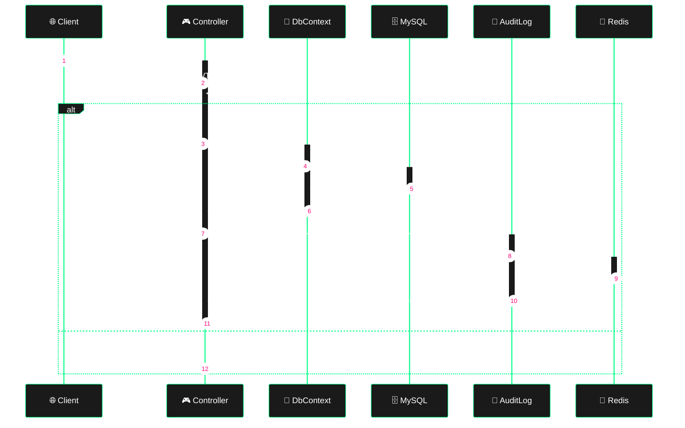

# AlertFrog SIMS - Simplified Architecture Diagram

## Layered Architecture View

```mermaid
%%{init: {'theme':'base', 'themeVariables': { 'primaryColor':'#1a1a1a','primaryTextColor':'#fff','primaryBorderColor':'#00ff88','lineColor':'#00ff88','secondaryColor':'#2a2a2a','tertiaryColor':'#3a3a3a','fontSize':'18px','fontFamily':'Arial'}}}%%
graph TB
    subgraph API["🌐 API Layer (Controllers)"]
        AUTH[AuthController<br/>Login/Register]
        USERS[UsersController<br/>User CRUD]
        INCIDENTS[IncidentsController<br/>Incident CRUD]
        LOGS[LogsController<br/>Audit Logs]
    end
    
    subgraph SERVICE["⚙️ Service Layer"]
        AUDIT[AuditLogService<br/>Redis Logging]
    end
    
    subgraph DATA["💾 Data Layer"]
        DBCONTEXT[AlertFrogDbContext<br/>EF Core]
        SEEDER[DbSeeder<br/>Initial Data]
    end
    
    subgraph DOMAIN["📦 Domain Models"]
        USER[User]
        ROLE[Role]
        INCIDENT[Incident]
    end
    
    subgraph STORAGE["🗄️ Storage"]
        MYSQL[(MySQL<br/>Relational Data)]
        REDIS[(Redis<br/>Audit Logs)]
    end
    
    subgraph CONFIG["⚙️ Configuration"]
        JWT[JwtOptions]
        REDISOPT[RedisOptions]
        SYSROLES[SystemRoles]
    end
    
    %% API to Service
    AUTH -.->|logs| AUDIT
    USERS -.->|logs| AUDIT
    INCIDENTS -.->|logs| AUDIT
    LOGS -->|reads| AUDIT
    
    %% API to Data
    AUTH -->|queries| DBCONTEXT
    USERS -->|CRUD| DBCONTEXT
    INCIDENTS -->|CRUD| DBCONTEXT
    
    %% API to Config
    AUTH -.->|uses| JWT
    AUTH -.->|enforces| SYSROLES
    USERS -.->|enforces| SYSROLES
    INCIDENTS -.->|enforces| SYSROLES
    LOGS -.->|enforces| SYSROLES
    
    %% Service to Storage
    AUDIT -->|writes/reads| REDIS
    AUDIT -.->|config| REDISOPT
    
    %% Data to Domain
    DBCONTEXT -->|manages| USER
    DBCONTEXT -->|manages| ROLE
    DBCONTEXT -->|manages| INCIDENT
    SEEDER -.->|seeds| DBCONTEXT
    
    %% Data to Storage
    DBCONTEXT -->|persists| MYSQL
    
    %% Domain Relationships
    USER -->|has| ROLE
    INCIDENT -->|assignedTo| USER
    INCIDENT -->|registeredBy| USER
    
    style API fill:#2a4a2a,stroke:#00ff88,stroke-width:3px
    style SERVICE fill:#2a3a4a,stroke:#00ff88,stroke-width:3px
    style DATA fill:#4a2a3a,stroke:#00ff88,stroke-width:3px
    style DOMAIN fill:#3a2a4a,stroke:#00ff88,stroke-width:3px
    style STORAGE fill:#4a3a2a,stroke:#00ff88,stroke-width:3px
    style CONFIG fill:#2a2a3a,stroke:#00ff88,stroke-width:3px
```

## Component Interaction Flow

## Data Flow: Incident Creation

```mermaid
%%{init: {'theme':'base', 'themeVariables': { 'primaryColor':'#1a1a1a','primaryTextColor':'#fff','primaryBorderColor':'#00ff88','lineColor':'#00ff88','fontSize':'18px'}}}%%
flowchart LR
    A[Client] -->|POST /api/incidents| B[IncidentsController]
    B -->|Validate JWT| C{Authorized?}
    C -->|No| D[401 Unauthorized]
    C -->|Yes| E[CreateIncident]
    E -->|Query Users| F[DbContext]
    F -->|SELECT| G[(MySQL)]
    G -->|Users| F
    F -->|Entities| E
    E -->|Create Incident| F
    F -->|INSERT| G
    G -->|Success| F
    F -->|Entity| E
    E -->|Log Action| H[AuditLogService]
    H -->|LPUSH| I[(Redis)]
    I -->|OK| H
    H -->|Logged| E
    E -->|Map to DTO| J[IncidentResponse]
    J -->|201 Created| A
    
    style B fill:#2a4a2a,stroke:#00ff88,stroke-width:2px
    style F fill:#4a2a3a,stroke:#00ff88,stroke-width:2px
    style H fill:#2a3a4a,stroke:#00ff88,stroke-width:2px
    style G fill:#4a3a2a,stroke:#00ff88,stroke-width:2px
    style I fill:#4a3a2a,stroke:#00ff88,stroke-width:2px
```

## Key Design Patterns

1. **Layered Architecture**: Clear separation between API, Service, Data, and Domain layers
2. **Repository Pattern**: DbContext abstracts data access
3. **DTO Pattern**: Request/Response objects separate from domain models
4. **Dependency Injection**: All dependencies injected via constructors
5. **Audit Logging**: Cross-cutting concern via AuditLogService
6. **Role-Based Authorization**: Declarative authorization with SystemRoles
