# AlertFrog SIMS - UML Class Diagram

```mermaid
classDiagram
    %% ========== DOMAIN MODELS ==========
    class User {
        +Guid Id
        +string Name
        +string Email
        +string PasswordHash
        +Guid RoleId
        +Role? Role
        +DateTime CreatedAt
    }

    class Role {
        +Guid Id
        +string Name
        +string? Description
        +DateTime CreatedAt
        +ICollection~User~ Users
    }

    class Incident {
        +Guid Id
        +string Title
        +string Description
        +string Severity
        +string Status
        +string? Cve
        +string? AffectedSystem
        +Guid AssignedUserId
        +User? AssignedUser
        +Guid RegistrantUserId
        +User? RegistrantUser
        +DateTime CreatedAt
        +DateTime UpdatedAt
        +DateTime? ResolvedAt
    }

    class AuditLogEntry {
        +Guid Id
        +DateTime Timestamp
        +string Action
        +string ActorEmail
        +string ActorRole
        +string? TargetEntity
        +string? Details
    }

    %% ========== DATA LAYER ==========
    class AlertFrogDbContext {
        +DbSet~User~ Users
        +DbSet~Role~ Roles
        +DbSet~Incident~ Incidents
        #OnModelCreating(ModelBuilder)
    }

    class DbSeeder {
        +EnsureSeedDataAsync(AlertFrogDbContext, IConfiguration)$ Task
        -EnsureRolesAsync(AlertFrogDbContext)$ Task
        -EnsureAdminAsync(AlertFrogDbContext)$ Task
        -EnsureSupportUsersAsync(AlertFrogDbContext)$ Task
        -EnsureIncidentsAsync(AlertFrogDbContext)$ Task
    }

    %% ========== SERVICES ==========
    class AuditLogService {
        -IConnectionMultiplexer _redis
        -string _keyPrefix
        -int MaxLogEntries
        +AuditLogService(IConnectionMultiplexer, IOptions~RedisOptions~)
        +LogAsync(string, string, string, string?, string?) Task
        +GetLogsAsync(int, int) Task~List~AuditLogEntry~~
    }

    %% ========== CONTROLLERS ==========
    class AuthController {
        -AlertFrogDbContext dbContext
        -IOptions~JwtOptions~ jwtOptions
        -AuditLogService auditLog
        +AuthController(AlertFrogDbContext, IOptions~JwtOptions~, AuditLogService)
        +Login(LoginRequest) Task~ActionResult~LoginResponse~~
        +Register(RegisterRequest) Task~IActionResult~
        -GenerateToken(User) string
    }

    class UsersController {
        -AlertFrogDbContext dbContext
        -AuditLogService auditLog
        +UsersController(AlertFrogDbContext, AuditLogService)
        +GetProfile() Task~ActionResult~ProfileResponse~~
        +GetUsers() Task~ActionResult~IEnumerable~UserSummaryResponse~~~
        +CreateUser(CreateUserRequest) Task~ActionResult~UserSummaryResponse~~
        +UpdateUser(Guid, UpdateUserRequest) Task~ActionResult~UserSummaryResponse~~
        +DeleteUser(Guid) Task~IActionResult~
        +UpdateProfile(UpdateProfileRequest) Task~ActionResult~ProfileResponse~~
        -GetCurrentUserAsync() Task~User?~
    }

    class IncidentsController {
        -AlertFrogDbContext dbContext
        -AuditLogService auditLog
        -string ManageIncidentRoles
        +IncidentsController(AlertFrogDbContext, AuditLogService)
        +GetIncidents() Task~ActionResult~IEnumerable~IncidentResponse~~~
        +CreateIncident(CreateIncidentRequest) Task~ActionResult~IncidentResponse~~
        +UpdateIncident(Guid, UpdateIncidentRequest) Task~ActionResult~IncidentResponse~~
        +ResolveIncident(Guid) Task~ActionResult~IncidentResponse~~
        +DeleteIncident(Guid) Task~IActionResult~
        +Escalate(Guid) Task~ActionResult~IncidentResponse~~
        -GetNextEscalationTargetAsync(Incident) Task~User?~
        -MapIncident(Incident)$ IncidentResponse
        -CanEscalate(string)$ bool
        -IsResolvedStatus(string)$ bool
        -GetCurrentUserAsync() Task~User?~
    }

    class LogsController {
        -AuditLogService auditLog
        +LogsController(AuditLogService)
        +GetLogs(int, int) Task~ActionResult~IEnumerable~AuditLogEntry~~~
    }

    %% ========== REQUEST DTOs ==========
    class LoginRequest {
        +string Email
        +string Password
    }

    class RegisterRequest {
        +string Name
        +string Email
        +string Password
        +string Role
    }

    class CreateUserRequest {
        +string Name
        +string Email
        +string Password
        +string Role
    }

    class UpdateUserRequest {
        +string? Name
        +string? Email
        +string? Password
        +string? Role
    }

    class UpdateProfileRequest {
        +string? Name
        +string? Email
        +string? CurrentPassword
        +string? NewPassword
    }

    class CreateIncidentRequest {
        +string Title
        +string Description
        +string Severity
        +string Status
        +string? Cve
        +string? AffectedSystem
        +Guid AssignedUserId
        +Guid? RegistrantUserId
    }

    class UpdateIncidentRequest {
        +string? Title
        +string? Description
        +string? Severity
        +string? Status
        +string? Cve
        +string? AffectedSystem
        +Guid? AssignedUserId
    }

    %% ========== RESPONSE DTOs ==========
    class LoginResponse {
        +Guid Id
        +string Token
        +string Name
        +string Email
        +string Role
    }

    class ProfileResponse {
        +Guid Id
        +string Name
        +string Email
        +string Role
    }

    class UserSummaryResponse {
        +Guid Id
        +string Name
        +string Email
        +string Role
        +DateTime CreatedAt
    }

    class IncidentResponse {
        +Guid Id
        +string Title
        +string Description
        +string Severity
        +string Status
        +string? Cve
        +string? AffectedSystem
        +Guid AssignedUserId
        +string AssignedUserName
        +string AssignedUserRole
        +Guid RegistrantUserId
        +string RegistrantName
        +DateTime CreatedAt
        +DateTime UpdatedAt
        +DateTime? ResolvedAt
        +bool CanEscalate
    }

    %% ========== OPTIONS ==========
    class JwtOptions {
        +string Issuer
        +string Audience
        +string Key
        +int ExpiryMinutes
    }

    class RedisOptions {
        +string ConnectionString
        +string KeyPrefix
    }

    %% ========== CONSTANTS ==========
    class SystemRoles {
        +string Admin$
        +string User$
        +string FirstLevel$
        +string SecondLevel$
        +Guid AdminId$
        +Guid UserId$
        +Guid FirstLevelId$
        +Guid SecondLevelId$
    }

    %% ========== RELATIONSHIPS ==========
    
    %% Domain Model Relationships
    User "1" --> "1" Role : has
    Role "1" --> "*" User : contains
    Incident "1" --> "1" User : assignedTo
    Incident "1" --> "1" User : registeredBy

    %% Data Layer
    AlertFrogDbContext --> User : manages
    AlertFrogDbContext --> Role : manages
    AlertFrogDbContext --> Incident : manages
    DbSeeder ..> AlertFrogDbContext : seeds

    %% Service Layer
    AuditLogService ..> AuditLogEntry : creates/retrieves
    AuditLogService ..> RedisOptions : uses

    %% Controller Dependencies
    AuthController --> AlertFrogDbContext : uses
    AuthController --> AuditLogService : logs
    AuthController --> JwtOptions : uses
    AuthController ..> LoginRequest : consumes
    AuthController ..> RegisterRequest : consumes
    AuthController ..> LoginResponse : produces

    UsersController --> AlertFrogDbContext : uses
    UsersController --> AuditLogService : logs
    UsersController ..> CreateUserRequest : consumes
    UsersController ..> UpdateUserRequest : consumes
    UsersController ..> UpdateProfileRequest : consumes
    UsersController ..> UserSummaryResponse : produces
    UsersController ..> ProfileResponse : produces

    IncidentsController --> AlertFrogDbContext : uses
    IncidentsController --> AuditLogService : logs
    IncidentsController ..> CreateIncidentRequest : consumes
    IncidentsController ..> UpdateIncidentRequest : consumes
    IncidentsController ..> IncidentResponse : produces

    LogsController --> AuditLogService : uses
    LogsController ..> AuditLogEntry : produces

    %% Authorization
    AuthController ..> SystemRoles : references
    UsersController ..> SystemRoles : enforces
    IncidentsController ..> SystemRoles : enforces
    LogsController ..> SystemRoles : enforces
```

## Architecture Overview

### Domain Layer
- **User**: Core entity representing system users with authentication and role assignment
- **Role**: Defines user permissions (Admin, User, 1st Level, 2nd Level)
- **Incident**: Security incident tracking with assignment, escalation, and resolution
- **AuditLogEntry**: Immutable log records stored in Redis for audit trail

### Data Layer
- **AlertFrogDbContext**: EF Core DbContext managing MySQL persistence
- **DbSeeder**: Ensures roles, admin user, support users, and sample incidents exist on startup

### Service Layer
- **AuditLogService**: Redis-backed audit logging service (capped at 1000 entries)

### Controller Layer (REST API)
- **AuthController**: JWT authentication (login/register)
- **UsersController**: User CRUD + profile management (admin-only for CRUD)
- **IncidentsController**: Incident CRUD + resolve/escalate operations
- **LogsController**: Admin-only audit log retrieval

### DTOs
- **Request DTOs**: Input validation and mapping for API operations
- **Response DTOs**: Structured API responses with computed fields

### Configuration
- **JwtOptions**: JWT token generation settings
- **RedisOptions**: Redis connection and key prefix configuration
- **SystemRoles**: Centralized role constants with GUIDs

## Key Design Patterns

1. **Repository Pattern**: DbContext abstracts data access
2. **DTO Pattern**: Separation of domain models and API contracts
3. **Dependency Injection**: Controllers receive services via constructor injection
4. **Audit Logging**: Cross-cutting concern handled by AuditLogService
5. **Role-Based Authorization**: Declarative `[Authorize(Roles = ...)]` attributes
6. **Escalation Chain**: 1st Level → 2nd Level → Admin
